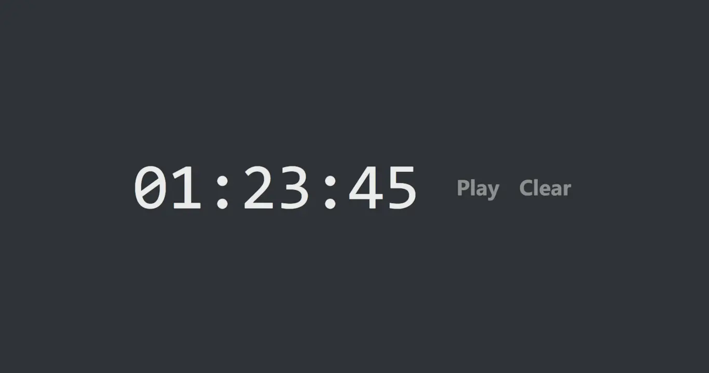

# Stopwatch

> https://stopwatch.crz.li

- Responsive and minimalist design, fit for embedding or full-screen display.
  - Works specially great in 📔[Notion](https://notion.so).
- Locally stored, persistent state — reopen the same URL in the same browser and it'll still be running.
- Keyboard accessible:
  - `C` to copy to clipboard.
  - `Space bar` to play/pause.
  - `Backspace` to clear.
  - `↑` or `Shift+↑` to increment.
  - `↓` or `Shift+↓` to decrement.
  - `L` to toggle color scheme.



## Development

Built with [Create React App](https://github.com/facebook/create-react-app).

```
npm install
npm start
```

## Legal

Apache-2.0 © 2020 Arthur Corenzan.
