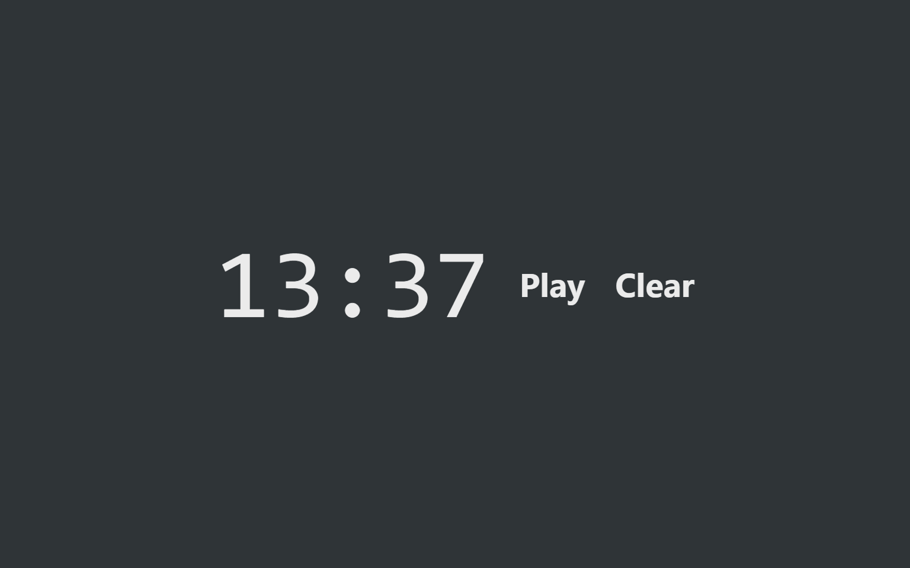

# Stopwatch

> https://stopwatch.crz.li

Stopwatch is a simple web application made in React, which have a persisting state based on an identifier in the URL. When you visit the application an ID is generated and the stopwatch state is stored using this ID. Subsequent visits to the same ID using the same browser restore the application's state. The vanilla and minimalist design makes it a perfect fit for embedding. Particularly my primary motivation was for having access to a simple stopwatch in my documents on [Notion](https://notion.so).



## Development

Built with [Create React App](https://github.com/facebook/create-react-app).

```
npm install
npm start
```

## Legal

The MIT License (MIT) © 2020 Arthur Corenzan.
